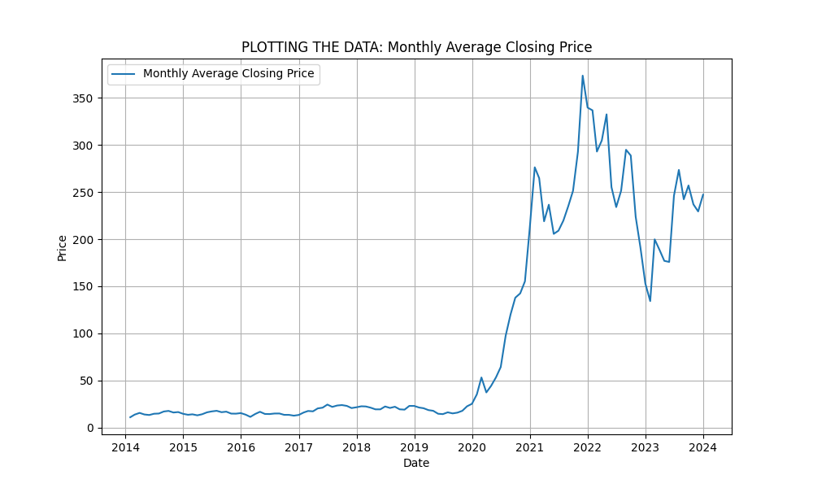
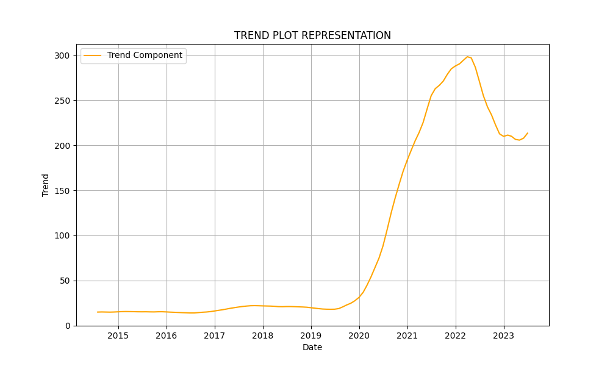
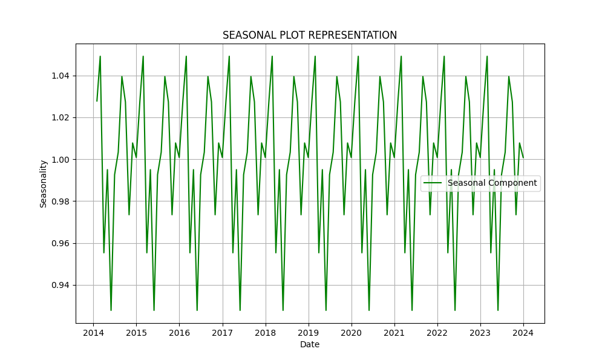
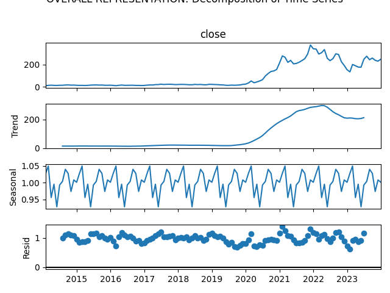

# NAME: Pranave B
# REG NO: 212221240040
# Ex.No: 05  IMPLEMENTATION OF TIME SERIES ANALYSIS AND DECOMPOSITION


### AIM:
To Illustrates how to perform time series analysis and decomposition on the tesla dataset

### ALGORITHM:
1. Import the required packages like pandas and numpy
2. Read the data using the pandas
3. Perform the decomposition process for the required data.
4. Plot the data according to need, either seasonal_decomposition or trend plot.
5. Display the overall results.

### PROGRAM:
```python
# Import necessary libraries
import pandas as pd
import matplotlib.pyplot as plt
from statsmodels.tsa.seasonal import seasonal_decompose

# Load the Tesla dataset
file_path = 'tsla_2014_2023.csv'  # Path to your uploaded file
data = pd.read_csv(file_path)

# Convert 'date' column to datetime format and set it as index
data['date'] = pd.to_datetime(data['date'])
data.set_index('date', inplace=True)

# Display the first five rows of the dataset
print("FIRST FIVE ROWS:")
print(data.head())

# Resample the data to get monthly average of the 'close' price
monthly_avg = data['close'].resample('M').mean()

# Plot the original monthly average closing price
plt.figure(figsize=(10, 6))
plt.plot(monthly_avg, label='Monthly Average Closing Price')
plt.title('PLOTTING THE DATA: Monthly Average Closing Price')
plt.xlabel('Date')
plt.ylabel('Price')
plt.legend()
plt.grid(True)
plt.savefig('monthly_avg_closing_price.png')  # Save as image
plt.show()

# Specify the period for decomposition (12 months for yearly seasonality)
period = 12

# Perform time series decomposition using a multiplicative model
result = seasonal_decompose(monthly_avg, model='multiplicative', period=period)

# Plot the seasonal component
plt.figure(figsize=(10, 6))
plt.plot(result.seasonal, label='Seasonal Component', color='green')
plt.title('SEASONAL PLOT REPRESENTATION')
plt.xlabel('Date')
plt.ylabel('Seasonality')
plt.legend()
plt.grid(True)
plt.savefig('seasonal_component.png')  # Save as image
plt.show()

# Plot the trend component
plt.figure(figsize=(10, 6))
plt.plot(result.trend, label='Trend Component', color='orange')
plt.title('TREND PLOT REPRESENTATION')
plt.xlabel('Date')
plt.ylabel('Trend')
plt.legend()
plt.grid(True)
plt.savefig('trend_component.png')  # Save as image
plt.show()

# Overall decomposition plot (trend, seasonal, residual)
plt.figure(figsize=(10, 8))
result.plot()
plt.suptitle('OVERALL REPRESENTATION: Decomposition of Time Series', y=1.02)
plt.tight_layout()
plt.savefig('overall_decomposition.png')  # Save as image
plt.show()

```

### OUTPUT:
# Plotting the data

# Trend Component

# Seasonal Component

# Overall Representation



### RESULT:
Thus, the python code for the time series analysis and decomposition.
